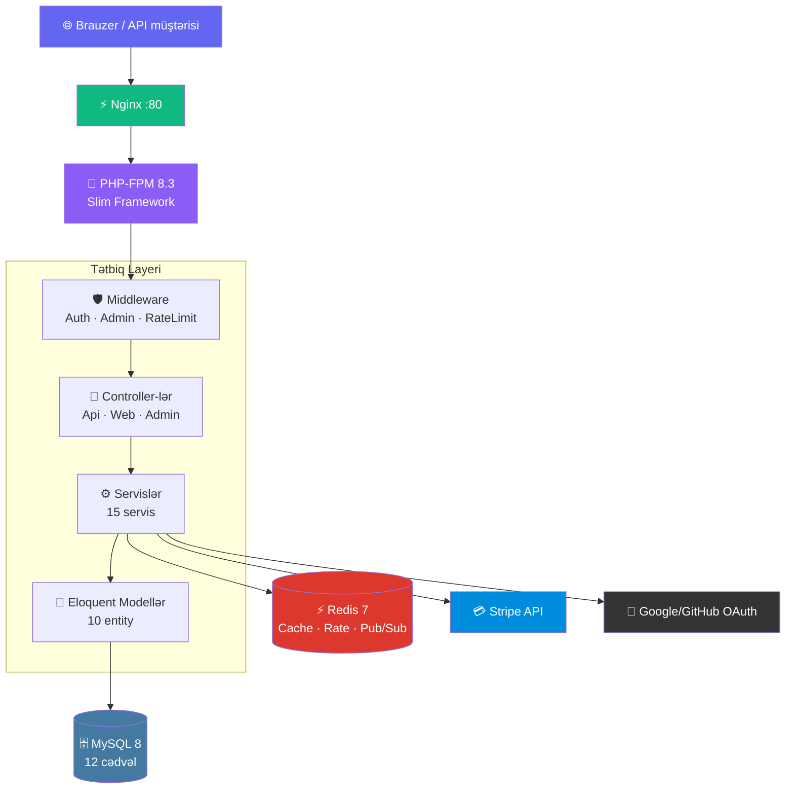

<div align="center">

<a href="https://github.com/goshgarhasanov/linkforge">
  
</a>

<p>
  <b>🌍 Language / Dil:</b> &nbsp;
  <a href="README.md"></a>
  <a href="README.az.md"></a>
</p>

<p>
  <a href="https://github.com/goshgarhasanov/linkforge/actions">
    
  </a>
  
  
  
  
  
  
  
  
</p>

<p>
  <a href="#-sürətli-başlanğıc">Sürətli Başlanğıc</a> •
  <a href="#-xüsusiyyətlər">Xüsusiyyətlər</a> •
  <a href="#-api">API</a> •
  <a href="#-memarlıq">Memarlıq</a> •
  <a href="#-təhlükəsizlik">Təhlükəsizlik</a> •
  <a href="CONTRIBUTING.md">Töhfə vermək</a>
</p>

<br>


</div>

---

## 🌟 LinkForge nədir?

> **LinkForge** — **PHP 8.3** və müasir ən yaxşı təcrübələrlə qurulmuş enterprise səviyyəli URL qısaltma platformasıdır. **Bit.ly + Rebrandly** kimi düşünün, lakin **açıq mənbəli**, **self-host edilə bilən** və **production-ready**. İnterfeys tam ikidillidir: **İngilis** və **Azərbaycan**.

<table>
<tr>
<td width="33%" align="center">

### 🔗 Qısalt
İstənilən uzun URL-i xüsusi alias, bitmə tarixi və şifrə qoruması ilə gözəl qısa linkə çevirin.

</td>
<td width="33%" align="center">

### 📊 Analiz et
Hər kliki real vaxtda izləyin: coğrafiya, cihaz, brauzer və referrer mənbələri. Bot filtrasiyası daxilidir.

</td>
<td width="33%" align="center">

### 🚀 Genişlən
REST API, webhook-lar, Stripe billing, OAuth2, 2FA — üzərində SaaS qurmaq üçün hər şey hazırdır.

</td>
</tr>
</table>

---

## ✨ Xüsusiyyətlər

<div align="center">

| 🔗 Əsas | 📊 Analitika | 🛡️ Təhlükəsizlik | 💼 Enterprise |
|:--------|:------------|:----------------|:--------------|
| ✅ Xüsusi alias | ✅ Coğrafi bölgü | ✅ Argon2id | ✅ OAuth2 (Google/GitHub) |
| ✅ Şifrə qoruması | ✅ Cihaz izləməsi | ✅ JWT (HS256) | ✅ TOTP 2FA |
| ✅ Bitmə tarixi | ✅ Referrer mənbələri | ✅ Rate limiting | ✅ E-poçt təsdiqi |
| ✅ Klik limiti | ✅ Brauzer statistikası | ✅ CSRF qoruması | ✅ Webhook (HMAC) |
| ✅ QR kod (PNG/SVG) | ✅ Saatlıq heatmap | ✅ IP anonimləşdirmə | ✅ Stripe billing |
| ✅ Deep linking | ✅ Zaman seriyaları | ✅ Bot aşkarlanması | ✅ Server-Sent Events |
| ✅ UTM avtomatik | ✅ CSV ixrac | ✅ Login lockout | ✅ Admin paneli |
| ✅ Toplu CSV idxal | ✅ Real-vaxt yenilənmə | ✅ HSTS, CSP | ✅ Audit jurnalı |
| ✅ **İkidilli UI** | ✅ **EN + AZ hər yerdə** | ✅ İstifadəçi başına dil | ✅ i18n daxili |

</div>

---

## 🌍 İkidilli İnterfeys

> Bütün istifadəçi interfeysi — landing səhifəsi, dashboard, admin paneli, xəta səhifələri və e-poçtlar — **İngilis** və **Azərbaycan** dillərində mövcuddur.

- 🇬🇧 **English** — beynəlxalq istifadəçilər üçün default
- 🇦🇿 **Azərbaycanca** — tam yerli tərcümə
- 🔁 Dil keçidi yuxarı naviqasiya panelində yerləşir
- 💾 Seçilmiş dil istifadəçi profilində və brauzer cookie-sində yadda saxlanılır
- 📁 Tərcümə faylları: `resources/lang/en.php` və `resources/lang/az.php`
- 🎯 Twig köməkçisi: `{{ t('dashboard.welcome') }}`

---

## 🚀 Sürətli Başlanğıc

> **LinkForge-u 2 dəqiqədən az müddətdə işə salın.** Docker tələb olunur.

```bash
# 1️⃣ Klonla
git clone https://github.com/goshgarhasanov/linkforge.git
cd linkforge

# 2️⃣ Konfiqurasiya
cp .env.example .env

# 3️⃣ Konteynerləri qaldır
docker compose up -d

# 4️⃣ Asılılıqlar və migration
docker compose exec php composer install
docker compose exec php php database/migrate.php
docker compose exec php php database/seed.php

# 5️⃣ Brauzeri aç
# → http://localhost:8080         (landing səhifəsi)
# → http://localhost:8080/docs    (Swagger UI)
# → http://localhost:8080/admin   (admin@linkforge.io / Admin12345)
```

> ⚠️ **Production qeydi:** Default admin şifrəsini dərhal dəyişdirin və `.env` faylında `APP_KEY`, `JWT_SECRET` və Stripe açarları üçün güclü dəyərlər təyin edin.

---

## 🏗️ Texniki Stack

<div align="center">

### Backend


### Verilənlər


### Frontend


### DevOps və Keyfiyyət


### İnteqrasiyalar


</div>

---

## 📡 API

> Tam interaktiv sənədləşmə: **`http://localhost:8080/docs`** (Swagger UI)

### 🔥 Nümunə: Qısa link yaratmaq

```bash
curl -X POST http://localhost:8080/api/v1/links \
  -H "Authorization: Bearer SIZIN_JWT_TOKEN" \
  -H "Content-Type: application/json" \
  -d '{
    "url": "https://example.com/cox-uzun-link",
    "alias": "menim-linkim",
    "title": "Portfolio saytım",
    "expires_at": "2026-12-31T23:59:59Z",
    "max_clicks": 1000,
    "password": "gizli123"
  }'
```

### 📚 Endpoint Soraqcası

<details>
<summary><b>🔐 Autentifikasiya və İstifadəçilər</b> (8 endpoint)</summary>

| Method | Endpoint | Təsvir | Auth |
|--------|----------|--------|:----:|
| `POST` | `/api/v1/auth/register` | Yeni istifadəçi qeydiyyatı | ❌ |
| `POST` | `/api/v1/auth/login` | Giriş və JWT əldə etmək | ❌ |
| `GET`  | `/api/v1/auth/me` | Cari istifadəçi profili | ✅ |
| `POST` | `/api/v1/auth/2fa/begin` | 2FA qeydiyyatını başlat | ✅ |
| `POST` | `/api/v1/auth/2fa/confirm` | 2FA-nı təsdiq et və aktivləşdir | ✅ |
| `POST` | `/api/v1/auth/2fa/disable` | 2FA-nı söndür | ✅ |
| `GET`  | `/auth/oauth/{provider}` | OAuth yönləndirməsi (Google/GitHub) | ❌ |
| `GET`  | `/auth/oauth/{provider}/callback` | OAuth callback | ❌ |

</details>

<details>
<summary><b>🔗 Linklər və Analitika</b> (7 endpoint)</summary>

| Method | Endpoint | Təsvir | Auth |
|--------|----------|--------|:----:|
| `POST`   | `/api/v1/links` | Yeni link yarat | ✅ |
| `GET`    | `/api/v1/links` | Linklərin siyahısı (səhifələnmiş, axtarış) | ✅ |
| `POST`   | `/api/v1/links/bulk` | CSV ilə toplu idxal (maks. 1000) | ✅ |
| `GET`    | `/api/v1/links/{code}` | Link təfərrüatları | ✅ |
| `DELETE` | `/api/v1/links/{code}` | Linki sil (soft) | ✅ |
| `GET`    | `/api/v1/links/{code}/analytics` | Klik analitikası | ✅ |
| `GET`    | `/api/v1/links/{code}/qr.{png,svg}` | QR kod | ❌ |

</details>

<details>
<summary><b>💳 Billing, Webhook və Real-vaxt</b> (9 endpoint)</summary>

| Method | Endpoint | Təsvir |
|--------|----------|--------|
| `GET`    | `/api/v1/billing/plans` | Subscription planlarının siyahısı |
| `GET`    | `/api/v1/billing/current` | Cari subscription |
| `POST`   | `/api/v1/billing/checkout` | Stripe Checkout sessiyası |
| `POST`   | `/api/v1/billing/webhook` | Stripe webhook qəbulu |
| `GET`    | `/api/v1/webhooks` | Webhook-ların siyahısı |
| `POST`   | `/api/v1/webhooks` | HMAC ilə imzalanan webhook yarat |
| `DELETE` | `/api/v1/webhooks/{id}` | Webhook-u sil |
| `GET`    | `/api/v1/notifications` | Bildirişlərin siyahısı |
| `GET`    | `/api/v1/stream` | Server-Sent Events axını |

</details>

<details>
<summary><b>👮 Admin</b> (13 endpoint)</summary>

| Method | Endpoint | Təsvir |
|--------|----------|--------|
| `GET`    | `/api/v1/admin/overview` | Sistem icmalı və artım |
| `GET`    | `/api/v1/admin/health` | DB/Redis/disk sağlamlığı |
| `GET`    | `/api/v1/admin/users` | İstifadəçilərin siyahısı (rol/status filtri) |
| `PATCH`  | `/api/v1/admin/users/{uuid}/role` | İstifadəçi rolunu dəyişdir |
| `PATCH`  | `/api/v1/admin/users/{uuid}/toggle-active` | İstifadəçini blokla/aç |
| `GET`    | `/api/v1/admin/links` | Bütün linklər (moderasiya) |
| `PATCH`  | `/api/v1/admin/links/{uuid}/flag` | Şübhəli linki işarələ |
| `PATCH`  | `/api/v1/admin/links/{uuid}/unflag` | İşarəni götür |
| `PATCH`  | `/api/v1/admin/links/{uuid}/toggle-active` | Aktiv/deaktiv et |
| `DELETE` | `/api/v1/admin/links/{uuid}` | Linki sil (sistem) |
| `GET`    | `/api/v1/admin/audit` | Audit jurnalı (filtrlənir) |

</details>

---

## 🏛️ Memarlıq



### 📁 Layihə Strukturu

```
linkforge/
├── 📂 app/
│   ├── 🎯 Controllers/      # HTTP handler-ləri (Api, Web, Admin)
│   ├── 🧬 Models/           # Eloquent modelləri (10 entity)
│   ├── ⚙️  Services/        # Biznes məntiqi (15 servis)
│   ├── 🛡️  Middleware/      # Auth, Admin, RateLimit
│   ├── ✅ Validators/       # Daxil olan məlumatların yoxlanması
│   ├── 📦 DTO/              # Data transfer obyektləri
│   ├── 🏷️  Enums/           # Tip-təhlükəsiz enum-lar
│   └── 🔧 Support/          # Application, Translator, köməkçilər
├── ⚙️  config/              # Konfiqurasiya faylları
├── 🗄️  database/migrations/ # 12 schema migration
├── 🌐 public/               # Web kökü + openapi.yaml
├── 🎨 resources/
│   ├── views/               # Twig şablonları (~25 view)
│   └── lang/                # 🌍 i18n: en.php, az.php
├── 🛣️  routes/              # API + web marşrutları
├── 🧪 tests/                # Unit, Feature, Integration
└── 🐳 docker/               # Konteyner konfiqurasiyaları
```

---

## 🛡️ Təhlükəsizlik

> **Təhlükəsizlik sonradan əlavə edilmir.** Hər endpoint, hər daxilolma, hər sirr.

<table>
<tr>
<th>🔐 Autentifikasiya</th>
<th>🚨 Hücum Qarşısının Alınması</th>
<th>📋 Uyğunluq</th>
</tr>
<tr>
<td valign="top">

- ✅ Argon2id şifrə hash-i
- ✅ JWT (HS256) tokenlər
- ✅ TOTP 2FA (Google Authenticator)
- ✅ OAuth2 state CSRF qoruması
- ✅ Login lockout (5 → 15 dəq)
- ✅ E-poçt təsdiqi (24 saat TTL)

</td>
<td valign="top">

- ✅ SQL injection (prepared stmt)
- ✅ XSS (Twig auto-escape, CSP)
- ✅ CSRF (web formaları)
- ✅ Rate limiting (Redis bucket)
- ✅ Bot aşkarlanması
- ✅ HMAC webhook imzaları

</td>
<td valign="top">

- ✅ IP anonimləşdirmə (GDPR)
- ✅ HSTS başlığı
- ✅ X-Frame-Options
- ✅ Referrer-Policy
- ✅ Audit jurnalı (admin əməliyyatları)
- ✅ Permissions-Policy

</td>
</tr>
</table>

---

## 🧪 Test və Keyfiyyət

```bash
# 🧪 Bütün testləri işə sal
docker compose exec php composer test

# 📊 Code coverage hesabatı
docker compose exec php composer test:coverage

# 🔍 Statik analiz (PHPStan Level 8)
docker compose exec php composer analyse

# ✨ Kod stilini avtomatik düzəlt (PSR-12)
docker compose exec php composer format
```

---

## 🗺️ Roadmap

<div align="center">

| Phase | Xüsusiyyət dəsti | Status |
|:-----:|:------------------|:------:|
| **1** | Foundation, auth, link CRUD, redirect, klik izləməsi | ✅ Tamam |
| **2** | Dashboard UI, qrafiklər, link idarəetməsi, QR kod, OpenAPI | ✅ Tamam |
| **3** | Admin paneli, user idarəetməsi, moderasiya, audit jurnalı | ✅ Tamam |
| **4** | OAuth2 (Google/GitHub), 2FA (TOTP), e-poçt təsdiqi | ✅ Tamam |
| **5** | Toplu CSV idxal, webhook (HMAC), rate limiting (Redis) | ✅ Tamam |
| **6** | Subscription planları, Stripe Checkout + webhook | ✅ Tamam |
| **7** | Real-vaxt yenilənmələr (SSE), bildirişlər | ✅ Tamam |
| **8** | **İkidilli UI (İngilis + Azərbaycan)** | ✅ Tamam |
| 9 | Mobil tətbiq (React Native) | 🚧 Gələcəkdə |
| 10 | Xüsusi domenlər, white-label | 🚧 Gələcəkdə |

</div>

---

## 📊 Layihə Statistikası

<div align="center">

| 📦 | Dəyər |
|---|---|
| **PHP faylları** | 65+ |
| **Twig şablonları** | 25+ |
| **Database migration-ları** | 12 cədvəl |
| **Toplam kod sətirləri** | ~8,500 |
| **API endpoint-ləri** | 45+ |
| **Servislər** | 15 |
| **Eloquent modelləri** | 10 |
| **Dəstəklənən dillər** | İngilis + Azərbaycan |

</div>

---

## 🤝 Töhfə vermək

Töhfələr **çox xoş gəlir**! 🎉

1. 🍴 Repository-ni fork edin
2. 🌿 Feature branch yaradın (`git checkout -b feature/yeni-funksiya`)
3. 💾 [Conventional Commits](https://www.conventionalcommits.org/) qaydası ilə commit edin (`git commit -m 'feat: yeni funksiya əlavə edildi'`)
4. 🚀 Push edin (`git push origin feature/yeni-funksiya`)
5. 📬 Pull Request açın

Ətraflı məlumat üçün [CONTRIBUTING.md](CONTRIBUTING.md) faylına baxın.

---

## 📜 Lisenziya

Bu layihə **MIT Lisenziyası** altında lisenziyalaşdırılıb — ətraflı məlumat üçün [LICENSE](LICENSE) faylına baxın.

---

## 👤 Müəllif

<div align="center">

### **Qoshqar Hasanov**

<p>
  <a href="https://github.com/goshgarhasanov">
    
  </a>
  <a href="mailto:hasnaov@gmail.com">
    
  </a>
</p>

</div>

---

<div align="center">


### ⭐ Layihəni bəyəndinizsə, ulduz verməyi unutmayın!

**Bakıda ❤️ ilə hazırlanıb**

</div>
