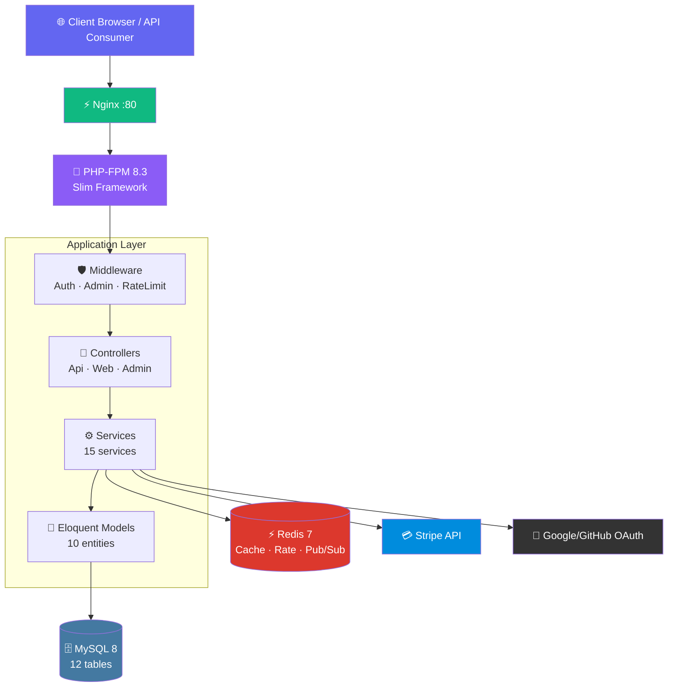

<div align="center">

<a href="https://github.com/goshgarhasanov/linkforge">
  
</a>

<p>
  <b>🌍 Language / Dil:</b> &nbsp;
  <a href="README.md"></a>
  <a href="README.az.md"></a>
</p>

<p>
  <a href="https://github.com/goshgarhasanov/linkforge/actions">
    
  </a>
  
  
  
  
  
  
  
  
</p>

<p>
  <a href="#-quick-start">Quick Start</a> •
  <a href="#-features">Features</a> •
  <a href="#-api">API</a> •
  <a href="#-architecture">Architecture</a> •
  <a href="#-security">Security</a> •
  <a href="CONTRIBUTING.md">Contributing</a>
</p>

<br>


</div>

---

## 🌟 What is LinkForge?

> **LinkForge** is an enterprise-grade URL shortener built with **PHP 8.3** and modern best practices. Think **Bit.ly + Rebrandly**, but **open-source**, **self-hostable**, and **production-ready**. The interface is fully bilingual: **English** and **Azerbaijani**.

<table>
<tr>
<td width="33%" align="center">

### 🔗 Shorten
Convert any long URL into a beautiful short link with custom aliases, expiration dates, and password protection.

</td>
<td width="33%" align="center">

### 📊 Analyze
Track every click with real-time geography, device, browser, and referrer breakdowns. Built-in bot filtering.

</td>
<td width="33%" align="center">

### 🚀 Scale
REST API, webhooks, Stripe billing, OAuth2, 2FA — everything you need to build a SaaS on top.

</td>
</tr>
</table>

---

## ✨ Features

<div align="center">

| 🔗 Core | 📊 Analytics | 🛡️ Security | 💼 Enterprise |
|:--------|:------------|:------------|:--------------|
| ✅ Custom alias | ✅ Geo breakdown | ✅ Argon2id | ✅ OAuth2 (Google/GitHub) |
| ✅ Password protection | ✅ Device tracking | ✅ JWT (HS256) | ✅ TOTP 2FA |
| ✅ Expiration dates | ✅ Referrer sources | ✅ Rate limiting | ✅ Email verification |
| ✅ Click limits | ✅ Browser stats | ✅ CSRF protection | ✅ Webhooks (HMAC) |
| ✅ QR codes (PNG/SVG) | ✅ Hourly heatmap | ✅ IP anonymization | ✅ Stripe billing |
| ✅ Deep linking | ✅ Time-series charts | ✅ Bot detection | ✅ Server-Sent Events |
| ✅ UTM auto-append | ✅ CSV export | ✅ Login lockout | ✅ Admin panel |
| ✅ Bulk CSV import | ✅ Real-time updates | ✅ HSTS, CSP | ✅ Audit log |
| ✅ **Bilingual UI** | ✅ **EN + AZ everywhere** | ✅ Per-user locale | ✅ i18n built-in |

</div>

---

## 🌍 Bilingual Interface

> The entire user interface — landing page, dashboard, admin panel, error pages, and emails — is available in **English** and **Azerbaijani**.

- 🇬🇧 **English** — default for international users
- 🇦🇿 **Azərbaycanca** — full native translation
- 🔁 Language switcher available in the top navigation bar
- 💾 Selected language is saved per user (in profile) and per browser (cookie)
- 📁 Translation files: `resources/lang/en.php` and `resources/lang/az.php`
- 🎯 Twig helper: `{{ t('dashboard.welcome') }}`

---

## 🚀 Quick Start

> **Get LinkForge running in under 2 minutes.** Requires Docker.

```bash
# 1️⃣ Clone
git clone https://github.com/goshgarhasanov/linkforge.git
cd linkforge

# 2️⃣ Configure
cp .env.example .env

# 3️⃣ Spin up
docker compose up -d

# 4️⃣ Install & migrate
docker compose exec php composer install
docker compose exec php php database/migrate.php
docker compose exec php php database/seed.php

# 5️⃣ Open browser
# → http://localhost:8080          (landing page)
# → http://localhost:8080/docs     (Swagger UI)
# → http://localhost:8080/admin    (admin@linkforge.io / Admin12345)
```

> ⚠️ **Production note:** Change the default admin password immediately and set strong values for `APP_KEY`, `JWT_SECRET`, and Stripe keys in `.env`.

---

## 🏗️ Tech Stack

<div align="center">

### Backend


### Data


### Frontend


### DevOps & Quality


### Integrations


</div>

---

## 📡 API

> Full interactive documentation: **`http://localhost:8080/docs`** (Swagger UI)

### 🔥 Example: Create a short link

```bash
curl -X POST http://localhost:8080/api/v1/links \
  -H "Authorization: Bearer YOUR_JWT_TOKEN" \
  -H "Content-Type: application/json" \
  -d '{
    "url": "https://example.com/very-long-url",
    "alias": "my-link",
    "title": "My portfolio",
    "expires_at": "2026-12-31T23:59:59Z",
    "max_clicks": 1000,
    "password": "secret123"
  }'
```

### 📚 Endpoint Reference

<details>
<summary><b>🔐 Authentication & Users</b> (8 endpoints)</summary>

| Method | Endpoint | Description | Auth |
|--------|----------|-------------|:----:|
| `POST` | `/api/v1/auth/register` | Register new user | ❌ |
| `POST` | `/api/v1/auth/login` | Login and receive JWT | ❌ |
| `GET`  | `/api/v1/auth/me` | Current user profile | ✅ |
| `POST` | `/api/v1/auth/2fa/begin` | Start 2FA enrollment | ✅ |
| `POST` | `/api/v1/auth/2fa/confirm` | Confirm and enable 2FA | ✅ |
| `POST` | `/api/v1/auth/2fa/disable` | Disable 2FA | ✅ |
| `GET`  | `/auth/oauth/{provider}` | OAuth redirect (Google/GitHub) | ❌ |
| `GET`  | `/auth/oauth/{provider}/callback` | OAuth callback | ❌ |

</details>

<details>
<summary><b>🔗 Links & Analytics</b> (7 endpoints)</summary>

| Method | Endpoint | Description | Auth |
|--------|----------|-------------|:----:|
| `POST`   | `/api/v1/links` | Create a new link | ✅ |
| `GET`    | `/api/v1/links` | List links (paginated, searchable) | ✅ |
| `POST`   | `/api/v1/links/bulk` | Bulk import via CSV (max 1000) | ✅ |
| `GET`    | `/api/v1/links/{code}` | Link details | ✅ |
| `DELETE` | `/api/v1/links/{code}` | Delete link (soft) | ✅ |
| `GET`    | `/api/v1/links/{code}/analytics` | Click analytics | ✅ |
| `GET`    | `/api/v1/links/{code}/qr.{png,svg}` | QR code | ❌ |

</details>

<details>
<summary><b>💳 Billing, Webhooks & Real-time</b> (9 endpoints)</summary>

| Method | Endpoint | Description |
|--------|----------|-------------|
| `GET`    | `/api/v1/billing/plans` | List subscription plans |
| `GET`    | `/api/v1/billing/current` | Current subscription |
| `POST`   | `/api/v1/billing/checkout` | Create Stripe Checkout |
| `POST`   | `/api/v1/billing/webhook` | Stripe webhook receiver |
| `GET`    | `/api/v1/webhooks` | List webhooks |
| `POST`   | `/api/v1/webhooks` | Create HMAC-signed webhook |
| `DELETE` | `/api/v1/webhooks/{id}` | Delete webhook |
| `GET`    | `/api/v1/notifications` | List notifications |
| `GET`    | `/api/v1/stream` | Server-Sent Events stream |

</details>

<details>
<summary><b>👮 Admin</b> (13 endpoints)</summary>

| Method | Endpoint | Description |
|--------|----------|-------------|
| `GET`    | `/api/v1/admin/overview` | System overview + growth |
| `GET`    | `/api/v1/admin/health` | DB/Redis/disk health |
| `GET`    | `/api/v1/admin/users` | List users (filter by role/status) |
| `PATCH`  | `/api/v1/admin/users/{uuid}/role` | Change user role |
| `PATCH`  | `/api/v1/admin/users/{uuid}/toggle-active` | Ban/unban user |
| `GET`    | `/api/v1/admin/links` | List all links (moderation) |
| `PATCH`  | `/api/v1/admin/links/{uuid}/flag` | Flag suspicious link |
| `PATCH`  | `/api/v1/admin/links/{uuid}/unflag` | Remove flag |
| `PATCH`  | `/api/v1/admin/links/{uuid}/toggle-active` | Activate/deactivate |
| `DELETE` | `/api/v1/admin/links/{uuid}` | Delete link (system) |
| `GET`    | `/api/v1/admin/audit` | Audit log (filterable) |

</details>

---

## 🏛️ Architecture



### 📁 Project Structure

```
linkforge/
├── 📂 app/
│   ├── 🎯 Controllers/      # HTTP handlers (Api, Web, Admin)
│   ├── 🧬 Models/           # Eloquent models (10 entities)
│   ├── ⚙️  Services/        # Business logic (15 services)
│   ├── 🛡️  Middleware/      # Auth, Admin, RateLimit
│   ├── ✅ Validators/       # Input validation
│   ├── 📦 DTO/              # Data transfer objects
│   ├── 🏷️  Enums/           # Type-safe enumerations
│   └── 🔧 Support/          # Application, Translator, helpers
├── ⚙️  config/              # Configuration files
├── 🗄️  database/migrations/ # 12 schema migrations
├── 🌐 public/               # Web root + openapi.yaml
├── 🎨 resources/
│   ├── views/               # Twig templates (~25 views)
│   └── lang/                # 🌍 i18n: en.php, az.php
├── 🛣️  routes/              # API + web routes
├── 🧪 tests/                # Unit, Feature, Integration
└── 🐳 docker/               # Container configurations
```

---

## 🛡️ Security

> **Security is not an afterthought.** Every endpoint, every input, every secret.

<table>
<tr>
<th>🔐 Authentication</th>
<th>🚨 Attack Prevention</th>
<th>📋 Compliance</th>
</tr>
<tr>
<td valign="top">

- ✅ Argon2id password hashing
- ✅ JWT (HS256) tokens
- ✅ TOTP 2FA (Google Authenticator)
- ✅ OAuth2 state CSRF
- ✅ Login lockout (5 → 15 min)
- ✅ Email verification (24h TTL)

</td>
<td valign="top">

- ✅ SQL injection (prepared stmt)
- ✅ XSS (Twig auto-escape, CSP)
- ✅ CSRF (web forms)
- ✅ Rate limiting (Redis bucket)
- ✅ Bot detection
- ✅ HMAC webhook signatures

</td>
<td valign="top">

- ✅ IP anonymization (GDPR)
- ✅ HSTS header
- ✅ X-Frame-Options
- ✅ Referrer-Policy
- ✅ Audit log (all admin actions)
- ✅ Permissions-Policy

</td>
</tr>
</table>

---

## 🧪 Testing & Quality

```bash
# 🧪 Run all tests
docker compose exec php composer test

# 📊 Generate coverage report
docker compose exec php composer test:coverage

# 🔍 Static analysis (PHPStan Level 8)
docker compose exec php composer analyse

# ✨ Auto-fix code style (PSR-12)
docker compose exec php composer format
```

---

## 🗺️ Roadmap

<div align="center">

| Phase | Feature Set | Status |
|:-----:|:------------|:------:|
| **1** | Foundation, auth, link CRUD, redirect, click tracking | ✅ Done |
| **2** | Dashboard UI, charts, link management, QR codes, OpenAPI | ✅ Done |
| **3** | Admin panel, user management, moderation, audit log | ✅ Done |
| **4** | OAuth2 (Google/GitHub), 2FA (TOTP), email verification | ✅ Done |
| **5** | Bulk CSV import, webhooks (HMAC), rate limiting (Redis) | ✅ Done |
| **6** | Subscription plans, Stripe Checkout + webhooks | ✅ Done |
| **7** | Real-time updates (SSE), in-app notifications | ✅ Done |
| **8** | **Bilingual UI (English + Azerbaijani)** | ✅ Done |
| 9 | Mobile app (React Native) | 🚧 Future |
| 10 | Custom domains, white-label | 🚧 Future |

</div>

---

## 📊 Project Stats

<div align="center">

| 📦 | Value |
|---|---|
| **PHP files** | 65+ |
| **Twig templates** | 25+ |
| **Database migrations** | 12 tables |
| **Total lines of code** | ~8,500 |
| **API endpoints** | 45+ |
| **Services** | 15 |
| **Eloquent models** | 10 |
| **Supported languages** | English + Azerbaijani |

</div>

---

## 🤝 Contributing

Contributions are **very welcome**! 🎉

1. 🍴 Fork the repository
2. 🌿 Create a feature branch (`git checkout -b feature/amazing-feature`)
3. 💾 Commit using [Conventional Commits](https://www.conventionalcommits.org/) (`git commit -m 'feat: add amazing feature'`)
4. 🚀 Push (`git push origin feature/amazing-feature`)
5. 📬 Open a Pull Request

See [CONTRIBUTING.md](CONTRIBUTING.md) for details.

---

## 📜 License

This project is licensed under the **MIT License** — see the [LICENSE](LICENSE) file for details.

---

## 👤 Author

<div align="center">

### **Qoshqar Hasanov**

<p>
  <a href="https://github.com/goshgarhasanov">
    
  </a>
  <a href="mailto:hasnaov@gmail.com">
    
  </a>
</p>

</div>

---

<div align="center">


### ⭐ If you like this project, please give it a star!

**Crafted with ❤️ in Baku, Azerbaijan**

</div>

---

## ☕ Support

If this project is useful to you, you can support me with a coffee — thank you!

**[☕ kofe.al/goshgarhasanov](https://kofe.al/goshgarhasanov)**
